# My Report Taste

A Codex skill for organizing reports through content tasks, evidence and density, then visual choices—with review and bilingual speaker scripts.

[中文](README.md) · [Style gallery](#style-gallery) · [Palette IDs](#reading-the-palette-ids) · [Installation](docs/installation.md) · [Example](examples/synthetic-study/README.md)

## What it does

- Organizes claims and evidence before choosing page layouts.
- Respects supplied conference templates and the current user's preferences.
- Keeps original readable figures, tables, and equations instead of redrawing everything.
- Checks slide plans and revisions without silently changing the intended conclusion.
- Separates spoken scripts from presenter notes and estimates English and Chinese timing independently.

This is a workflow and validation layer, not a bundled slide-rendering engine or a guarantee of scientific correctness or visual quality. It does not upload your files automatically.

## Install

Download this repository, then run with Python 3.10+:

```bash
git clone https://github.com/maplejyz99-droid/my-report-taste.git
cd my-report-taste
python3 tools/install.py
```

The installer copies the skill into `~/.agents/skills/my-report-taste`. Existing installations are preserved. For a project-specific location, use `--dest /path/to/project/.agents/skills`. Invoke `$my-report-taste` in Codex; restart if the new skill does not appear.

Example request:

> Use $my-report-taste to plan an English conference talk from this paper. Preserve the supplied conference template. Account for the key figures and tables before making slides.

> Use $my-report-taste to prepare English and Chinese scripts for this exact deck version. Exclude backup slides from the talk time and write an actual shorter version.

## Three content tasks, not nine story templates

Choose the communication task before the visual treatment:

| Task | Main question |
|---|---|
| Explain research or technology (`explain`) | What is being studied, how does it work, and what does the evidence support? |
| Report progress or results (`progress`) | What has the new evidence changed, and what remains unresolved? |
| Compare options or support a choice (`compare`) | What are the benefits, costs, and constraints under comparable conditions? |

Comparison does not imply recommendation. Give a conditional preference only when the user asks for a choice. A report can have one primary task and use another locally; none imposes a fixed outline, page count, three-bullet pattern, or future-work section.

Then choose evidence and density for the material and viewing distance, and apply the supplied template or an optional appearance. Green should not add milestones; wine should not invent a research agenda.

> Use $my-report-taste. The group already knows the background. Focus on what these new results changed. Borrow the project-green appearance without adding milestones or deployment advice.

> Use $my-report-taste. Compare the options without choosing a winner. Keep the existing content and borrow only the academic-oral-wine appearance.

For automation, `--content` selects the task, `--visual` borrows presentation only, `--preset` selects a full bundle, and `--card` selects individual dimensions. [Content rules](skills/my-report-taste/references/content-modes.md) · [Routing and compatibility](skills/my-report-taste/references/routing.md)

Less templated writing starts with editing: concrete evidence, less repeated background, and proportionate attention to difficult points. It is not a word blacklist or a requirement to change every layout. The checks do not guarantee that generated content is free of an “AI-written” feel.

## Content before styling

The same rough notes contain Baseline 84% / 120 ms, Compact 86% / 85 ms and Large 86.5% / 160 ms. The organized result page retains every setting, unit and synthetic-data disclosure, separates percentage points from relative change, and keeps the unmeasured conditions visible.

The [before/after editing example](examples/synthetic-study/editing-case.md) also states what a request to enlarge the table should preserve. It is an authored teaching example, not an observed skill-on/off experiment.


[Five-page PPTX, plan and bilingual scripts](examples/synthetic-study/README.md) · [Python-only HTML/Markdown rebuild](examples/portable-report/README.md) · [Task-level evaluation protocol and limits](docs/evaluation.md)

## Style gallery

Browse **presentation candidates, page types, reading modes, and palettes** separately. The original nine convenience bundles are no longer presented as nine independent themes. The three content tasks remain unchanged.

- Former 01/03/04 share the Light editorial entry. Metrics, experimental charts, and architecture are page types within that family.
- Dense reading is listed separately as a reading layout, not counted as another color theme.
- The six candidates below support comparison; **they are not six proven mutually distinct themes**. Existing preset IDs and invocation behavior remain compatible.

### Same-content comparison

Every candidate shows the same two pages: results on the left, mechanism on the right. Titles, all three data rows, both deltas, four mechanism nodes, and limitations stay fixed. Evidence placement, navigation, type hierarchy, and color can change. Every number comes from the original synthetic fixture.

[Comparison notes and editable files](examples/style-gallery/comparison/README.md) · [Nine retained page-type examples](examples/style-gallery/README.md) · [Palette IDs](#reading-the-palette-ids)

### 01 · Light editorial

Metrics, experimental charts, and architecture flows share this entry. Page purpose determines evidence form; changing page type does not create a new theme.

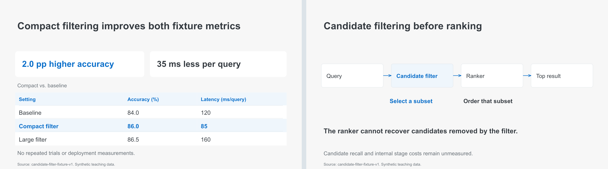

[Full-size result](examples/style-gallery/comparison/pages/light-editorial/result.png) · [Full-size mechanism](examples/style-gallery/comparison/pages/light-editorial/mechanism.png) · [Editable two-page PPTX](examples/style-gallery/comparison/pages/light-editorial/example.pptx)

Palette: [CLR-002](skills/my-report-taste/references/CLR-002.md). Existing invocation: `--visual author-light`. Display names are not new CLI parameters.

The existing `experiment-review` and `technical-review-light` routes retain their engineering-evidence/flow rules. Only the README entry is merged. Browse the original [metrics/table](examples/style-gallery/pages/author-light.png), [experimental chart](examples/style-gallery/pages/experiment-review.png), and [architecture flow](examples/style-gallery/pages/technical-review-light.png) examples separately.

### 02 · Academic evidence

Formal evidence leads, with dedicated explanation and source placement. Wine is the example palette, not a requirement of academic evidence. NAR-001 narrative rules are not loaded.

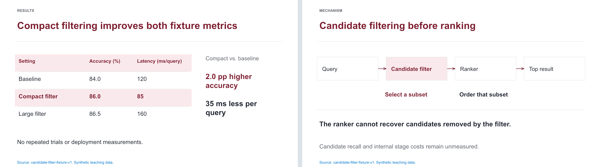

[Full-size result](examples/style-gallery/comparison/pages/academic-evidence/result.png) · [Full-size mechanism](examples/style-gallery/comparison/pages/academic-evidence/mechanism.png) · [Editable two-page PPTX](examples/style-gallery/comparison/pages/academic-evidence/example.pptx)

Palette: [CLR-010](skills/my-report-taste/references/CLR-010.md). Existing invocation: `--visual academic-oral-wine`. Display names are not new CLI parameters.

### 03 · Dark editorial

Petroleum backgrounds, shared blue-gray surfaces, and luminance hierarchy. Both pages separate primary evidence from explanation. Gold is not a default.

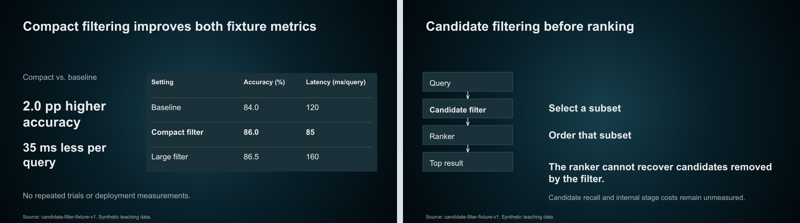

[Full-size result](examples/style-gallery/comparison/pages/dark-editorial/result.png) · [Full-size mechanism](examples/style-gallery/comparison/pages/dark-editorial/mechanism.png) · [Editable two-page PPTX](examples/style-gallery/comparison/pages/dark-editorial/example.pptx)

Palette: [CLR-003](skills/my-report-taste/references/CLR-003.md). Existing invocation: `--visual technical-review-dark`. Display names are not new CLI parameters.

### 04 · Light navigation

A light border and small section capsule sit above white content. The existing green palette remains. This overlaps with light editorial and is not claimed as a proven independent theme.

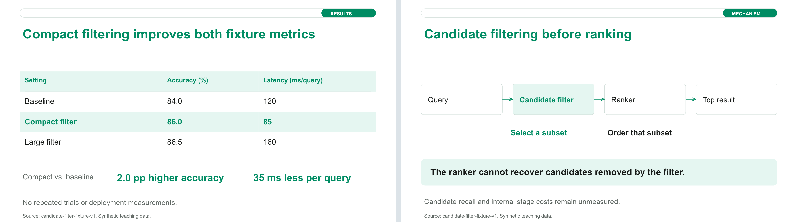

[Full-size result](examples/style-gallery/comparison/pages/green-navigation/result.png) · [Full-size mechanism](examples/style-gallery/comparison/pages/green-navigation/mechanism.png) · [Editable two-page PPTX](examples/style-gallery/comparison/pages/green-navigation/example.pptx)

Palette: [CLR-006](skills/my-report-taste/references/CLR-006.md). Existing invocation: `--visual project-green`. Display names are not new CLI parameters.

### 05 · Rail evidence

A fixed narrow rail anchors navigation around continuous evidence. A small sand mark identifies the second metric on the result page. The mechanism page does not force a second color role.

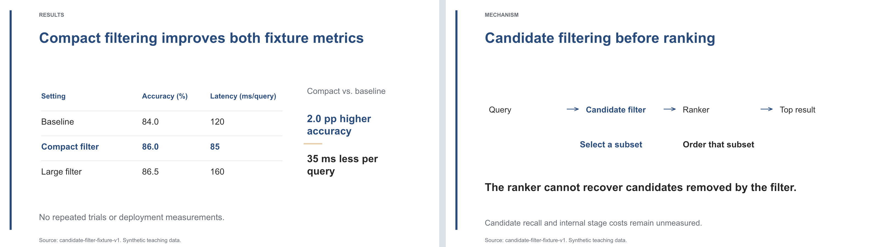

[Full-size result](examples/style-gallery/comparison/pages/rail-evidence/result.png) · [Full-size mechanism](examples/style-gallery/comparison/pages/rail-evidence/mechanism.png) · [Editable two-page PPTX](examples/style-gallery/comparison/pages/rail-evidence/example.pptx)

Palette: [CLR-007](skills/my-report-taste/references/CLR-007.md). Existing invocation: `--visual project-summary-dual-semantics`. Display names are not new CLI parameters.

### 06 · Neutral editorial

Type scale, placement, fine rules, and grayscale organize evidence. Source material can retain color. These table/flow examples do not test image-led pages or cross-page rhythm, so independence remains unproven.

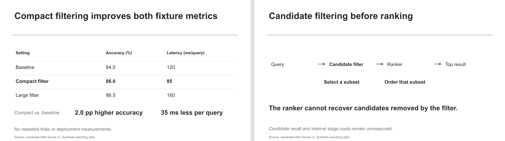

[Full-size result](examples/style-gallery/comparison/pages/neutral-editorial/result.png) · [Full-size mechanism](examples/style-gallery/comparison/pages/neutral-editorial/mechanism.png) · [Editable two-page PPTX](examples/style-gallery/comparison/pages/neutral-editorial/example.pptx)

Palette: [CLR-008](skills/my-report-taste/references/CLR-008.md). Existing invocation: `--visual neutral-evidence-review`. Display names are not new CLI parameters.

## Independent-reading layout

`dense-reading-report` — Reading-oriented density, shown at an A-series landscape ratio; not a projection default or an automatic format change.


Palette: **no fixed CLR ID**. This bundle selects `GRD-004 + OTH-003` without binding a palette. The swatches below record the [current example builder](examples/style-gallery/build_gallery.mjs), not a new preset or `CLR-010`.

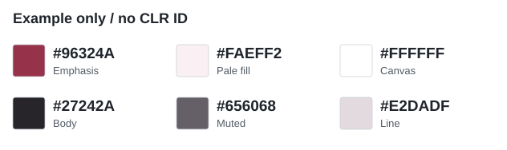

- Example emphasis `#96324A`; pale fill `#FAEFF2`; canvas `#FFFFFF`.
- Body `#27242A`; muted `#656068`; line `#E2DADF`.

Choose another color card or retain the user's/official template colors as needed; color does not determine reading density.

> Use $my-report-taste and borrow only the `dense-reading-report` presentation rules. Follow the current content task and preserve the established argument and evidence.

## Reading the palette IDs

`CLR` identifies color, `GRD` layout/density, and `NAR` narrative. Select them separately. Six palettes do not imply six content routes or prove layout independence.

The values below come from existing color cards as approximate reconstruction recipes, not official third-party brand tokens. Equal swatch sizes do not prescribe area ratios; pages select shades by role. The reading example's colors are labeled separately above and have no new CLR ID.

> Use $my-report-taste with only CLR-006. Keep the content, page order, and layout unchanged. Use an exception color only for a real risk.

Palette: [CLR-002 · Bright blue](skills/my-report-taste/references/CLR-002.md)

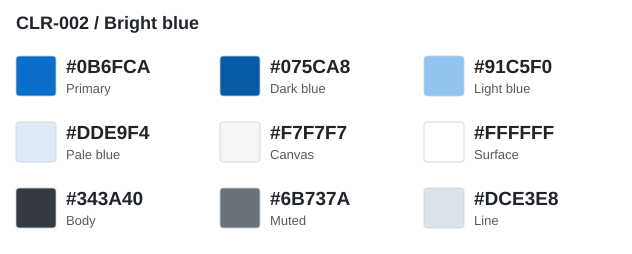

- Primary `#0B6FCA`; dark `#075CA8`; light `#91C5F0`; pale fill `#DDE9F4`.
- Canvas `#F7F7F7`; surface `#FFFFFF`; body `#343A40`; muted `#6B737A`; line `#DCE3E8`.

Coral `#FE7265` is reserved for real risks/exceptions, not ordinary method categories.

Palette: [CLR-010 · Academic wine](skills/my-report-taste/references/CLR-010.md)

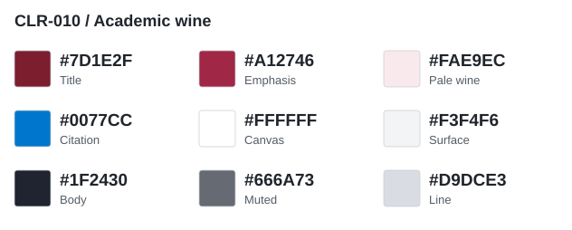

- Title `#7D1E2F`; emphasis `#A12746`; pale wine `#FAE9EC`; citations/links `#0077CC`.
- Canvas `#FFFFFF`; surface `#F3F4F6`; body `#1F2430`; muted `#666A73`; line `#D9DCE3`.

Citation blue is not decorative. Purple/navy branch colors require a real semantic distinction; see the full card for values.

Palette: [CLR-003 · Dark petroleum](skills/my-report-taste/references/CLR-003.md)

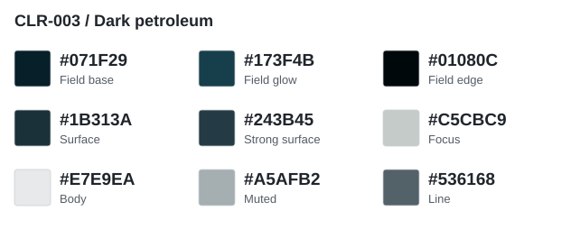

- Field anchors `#071F29` → `#173F4B`, edge `#01080C`; surfaces `#1B313A` / `#243B45`.
- Body `#E7E9EA`; muted `#A5AFB2`; line `#536168`; low-saturation focus `#C5CBC9`.

These anchors describe soft background depth, not a segmented gradient strip. Gold is not the default; `#C9A84A` is conditional on a clearly justified single focus.

Palette: [CLR-006 · Fresh green and mint](skills/my-report-taste/references/CLR-006.md)

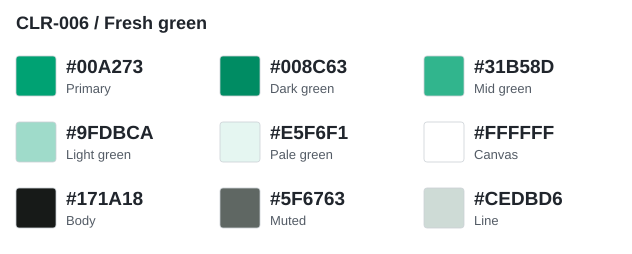

- Primary `#00A273`; dark `#008C63`; mid `#31B58D`; light `#9FDBCA`; mint fill `#E5F6F1`.
- Canvas `#FFFFFF`; body `#171A18`; muted `#5F6763`; line `#CEDBD6`.

Orange `#F07F3C` is for exceptions. Yellow `#F2D84C` requires a separate second metric in the same chart; neither is a routine decoration.

Palette: [CLR-007 · Blue and sand](skills/my-report-taste/references/CLR-007.md)

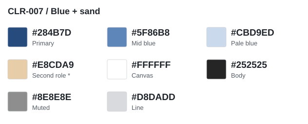

- Primary `#284B7D`; mid `#5F86B8`; pale `#CBD9ED`; second-role sand `#E8CDA9`.
- Canvas `#FFFFFF`; body `#252525`; muted `#8E8E8E`; line `#D8DADD`.

`Second role *` means **use sand only when a second semantic role exists**, not a 50/50 blue-gold split or a risk indicator. Muted gray is for short labels; recheck contrast for projection.

Palette: [CLR-008 · Neutral](skills/my-report-taste/references/CLR-008.md)

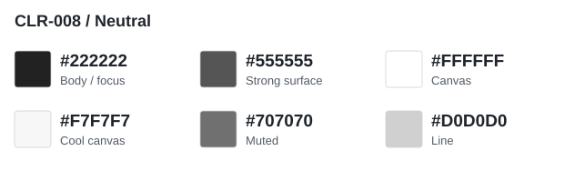

- Body/key series `#222222`; strong surface `#555555`; muted `#707070`.
- Canvas `#FFFFFF` or `#F7F7F7`; line `#D0D0D0`.

There is no fixed chromatic accent. Photos and screenshots retain their original colors without turning them into global theme colors.

Store your preferences in a project `.report-taste/profile.md`; these files are not distributed.

## Validate

```bash
python3 skills/my-report-taste/scripts/doctor.py
python3 skills/my-report-taste/scripts/library.py route --content explain --template
python3 skills/my-report-taste/scripts/library.py route --content progress --visual author-light --template-state absent
python3 skills/my-report-taste/scripts/library.py route --content compare --visual technical-review-dark --template-state absent
python3 skills/my-report-taste/scripts/library.py route --card NAR-001 --template
python3 skills/my-report-taste/scripts/library.py validate --strict
python3 -m unittest discover -s skills/my-report-taste/tests -p 'test_*.py'
python3 -m unittest discover -s tests -p 'test_*.py'
python3 tools/check_public_release.py
```

Core checks use the standard library. Image color checks require Pillow. Optional PPTX/PDF conversion and inspection require external rendering tools; see [installation and limitations](docs/installation.md). Automatic checks do not replace source review, rendered-page inspection, translation review, or rehearsal.

Free-text routing returns inactive candidates. Resolve intent first, then pass `--content` and, if needed, `--visual`, `--preset`, or repeated `--card` arguments. The nine existing preset IDs remain supported. Template state is explicitly `provided`, `absent` or `unknown`; `--template` means `provided`. Parameters record caller declarations, not authorization. See [routing migration](skills/my-report-taste/references/routing.md) and [0.3.0 changes and local validation](docs/release-notes-v0.3.0.md).

## License

Project code, original documentation, and synthetic examples are MIT-licensed. Third-party source decks, screenshots, logos, fonts, and private feedback are not bundled or relicensed. See [notices](THIRD_PARTY_NOTICES.md).
