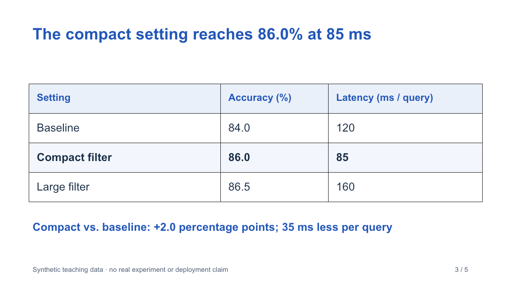
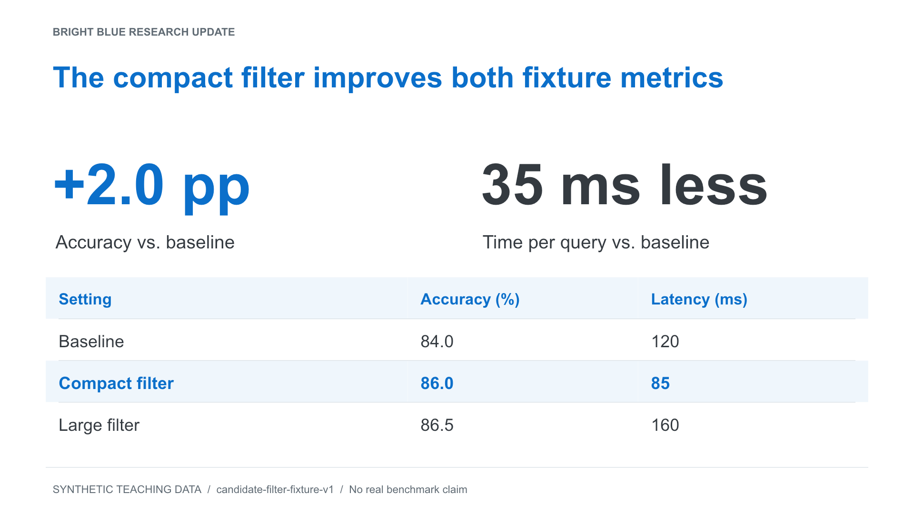
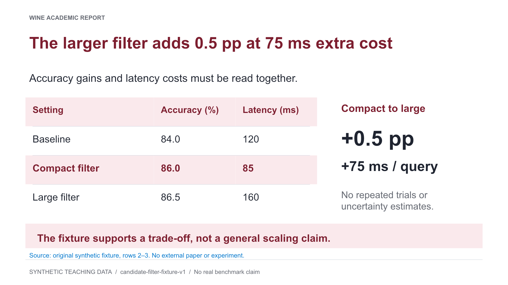
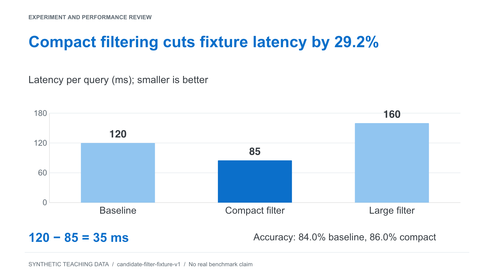
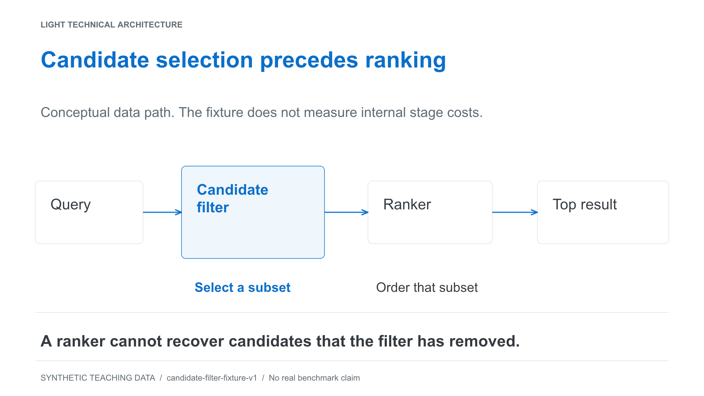
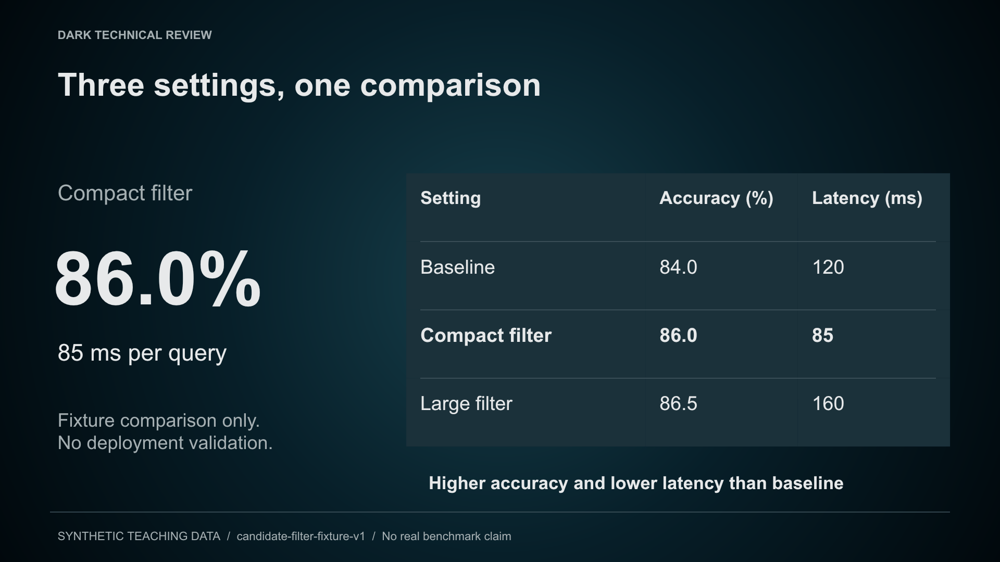
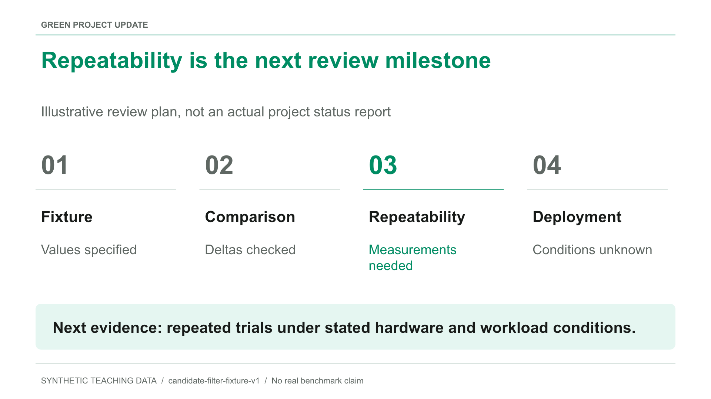
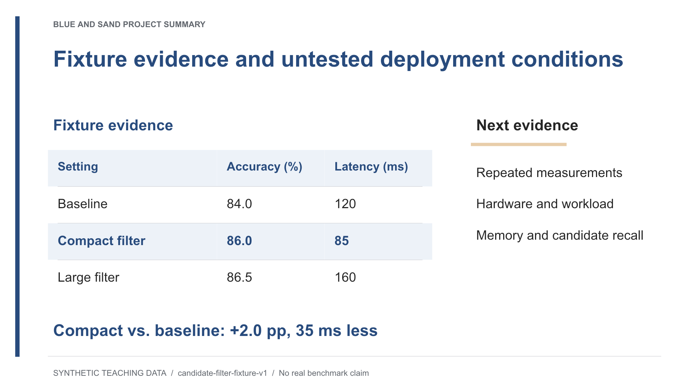
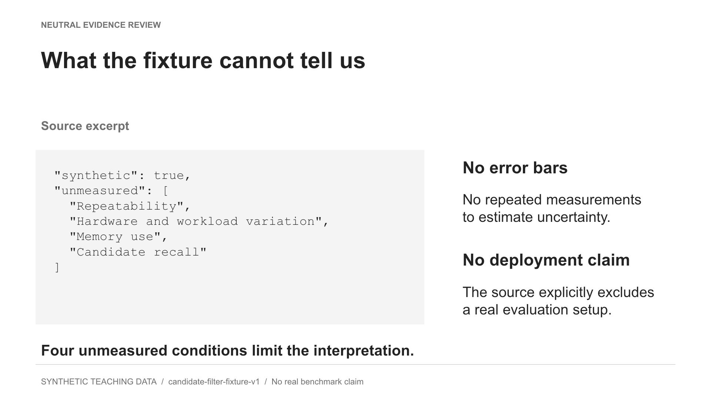
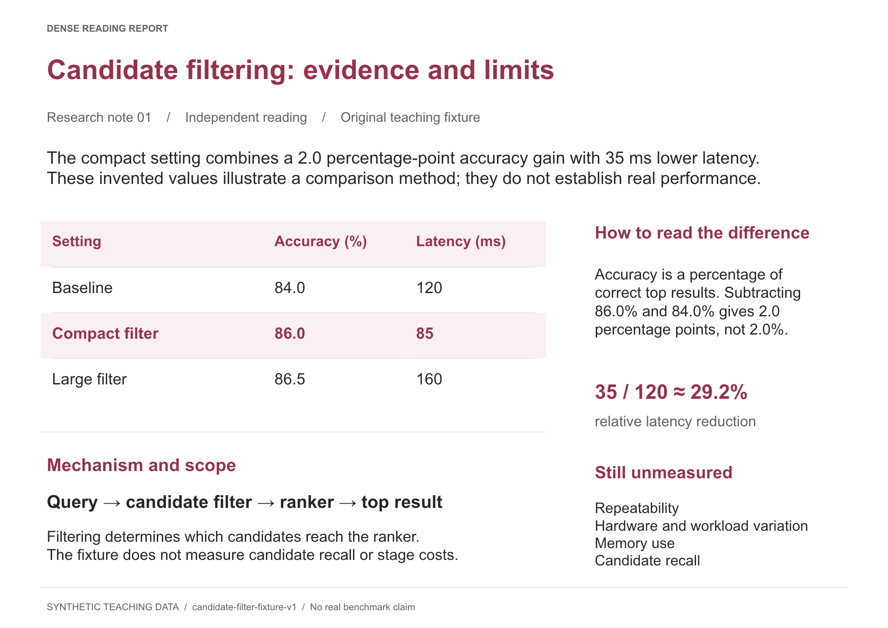

# My Report Taste

**把你认可的汇报方式变成可复用的工作流，而不是反复换一套 PPT 皮肤。**

[English](README.en.md) · [风格预览](#风格预览) · [安装](docs/installation.md) · [定制自己的偏好](docs/customization.md) · [完整示例](examples/synthetic-study/README.md)

这是一个面向 Codex 的个人汇报品味 skill：按“内容任务 → 证据与密度 → 视觉外观”组织材料，核对成品，再整理逐页中英文讲稿。支持 PPT、PDF、HTML 幻灯片和汇报型 Markdown；实际文件生成与渲染由使用环境提供。

## 它解决什么

- 先梳理论文或实验，再决定每页放什么；原图、表格、公式有明确去向。
- 保留官方模板与当前用户意图，不把作者喜欢的颜色当作所有人的默认。
- 区分真正的证据密度与缩字堆内容，避免连续套用同一种卡片页。
- 修订时保护已确认的结论与主线，记录页序、角色和立场变化。
- 讲稿对应实际版本，中英文分别计数与估时；短版必须有真正缩短的正文。
- 区分机械检查、视觉核验、事实核验和真人试讲，不用一个 PASS 冒充全部完成。

它不是自动保证“好看”的生成器，不自带 PowerPoint 引擎，不会自动上传材料，也不能替代研究者核对科学结论。

## 快速开始

需要 Python 3.10+。下载本仓库后，在仓库目录运行：

```bash
git clone https://github.com/maplejyz99-droid/my-report-taste.git
cd my-report-taste
python3 tools/install.py
```

默认安装到 `~/.agents/skills/my-report-taste`；若已有同名版本会停止，不覆盖个人库。也可以使用项目级安装，见[安装说明](docs/installation.md)。目前按 Codex 官方本地 skill 发现机制组织；其他代理产品需自行验证，未宣称全平台兼容。

之后在 Codex 中调用：

> 使用 $my-report-taste。我要做一份英文会议 Oral，已有官方模板。先核对论文的主张、图表和方法，再给逐页内容计划，暂时不做 PPT。

> 使用 $my-report-taste，按当前 PPT 的实际页序写中文和英文讲稿。主讲目标 12 分钟，备份页不计时，给出真正可讲的短版。

> 使用 $my-report-taste。收藏这份报告的表格组织方式，不收藏它的颜色；记录适用场景和来源。

## 三类内容任务，不是九套内容套路

先判断这次汇报要完成什么，再决定重点和顺序：

| 内容任务 | 主要回答的问题 |
|---|---|
| 研究／技术讲解（explain） | 研究对象是什么，方法如何工作，证据支持什么？ |
| 进展／结果汇报（progress） | 相比之前，新增证据改变了什么判断，还有什么没解决？ |
| 方案比较／选择（compare） | 按相同标准看，各方案的收益、代价与约束是什么？ |

比较不等于推荐；只有任务需要选择时才给有条件的倾向。同一报告可以以一种任务为主、局部借用另一种，不强制目录、页数、三个 bullet 或独立未来工作页。

证据形式和密度再按材料、受众与阅读距离决定；最后采用官方模板、自己的偏好或下方九种呈现组合。**换成绿色不应多出里程碑，换成酒红也不应凭空补出研究议程。**

直接说明任务即可，不需要先学参数：

> 使用 $my-report-taste。组里已经知道背景，重点讲这次实验改变了什么判断。外观借用 project-green，不增加里程碑或部署建议。

> 使用 $my-report-taste。只比较这几种方案的收益与代价，暂时不替我们选。已有内容不变，只把外观调整为 academic-oral-wine。

给代理或自动化使用时，`--content` 选任务，`--visual` 仅借呈现，`--preset` 明确选完整组合，`--card` 选单个维度。[内容取舍规则](skills/my-report-taste/references/content-modes.md) · [参数与兼容说明](skills/my-report-taste/references/routing.md)

减少模板感首先靠内容编辑：保留具体对象与证据，删掉重复背景和无信息增量的总结，给难点足够篇幅。不是禁用某些词，也不是要求每页换一种布局；现有检查不能保证生成稿已经“没有 AI 味”。

## 先看内容怎样组织

同一份散乱笔记：Baseline 84% / 120 ms，Compact 86% / 85 ms，Large 86.5% / 160 ms。编辑后的页面保留全部设置、单位与合成数据身份，区分“增加 2.0 个百分点”和“延迟相对减少 29.2%”，并说明尚未测量什么。

[修改前—组织后案例](examples/synthetic-study/editing-case.md)展示这些取舍，也列出“只放大表格”时应保留的结论与页面。它是教学示例，不是已完成的有／无 skill 对照。



[完整五页 PPTX、内容计划与双语讲稿](examples/synthetic-study/README.md) · [仅需 Python 的 HTML／Markdown 重建路径](examples/portable-report/README.md) · [任务级评测方案与未验证项](docs/evaluation.md)

## 风格预览

公开版保留 35 张文字模式卡，但没有替新使用者确认任何偏好。卡片中的 approved／confirmed 是作者示例库的评价；官方模板与当前任务始终优先。

下面是 **9 个可选呈现组合，每个组合一张代表性内容页**。它们保留布局、密度、证据表达与配色的区别，但不分别规定九条内容路线，也不只是九种颜色。全部使用同一份原创合成数据，从实际可编辑页面导出；点击图片可查看原尺寸。

单页预览只能展示页面语法，不能证明完整叙事或跨页节奏。图中的章节和表达方式是该示例的选择，不是选中外观后必须复制的内容。例如酒红完整组合保留 `NAR-001 + GRD-010 + CLR-010`；只借呈现时采用 `GRD-010 + CLR-010`，不加载叙事卡。高密度报告预览保留自己的阅读比例，但实际输出媒介仍由任务决定。

[预设说明](skills/my-report-taste/references/author-presets.md) · [图片、可编辑单页与构建源代码](examples/style-gallery/README.md)

### 01 · 明亮蓝研究汇报

`author-light` — 明亮蓝与浅色编辑式页面；预览用关键变化和比较表展示层级。



> 使用 $my-report-taste，只借用 `author-light` 的呈现规则；内容按当前任务组织，保留已确认主线与证据。

### 02 · 酒红学术报告

`academic-oral-wine` — 酒红标题、正式证据和可见来源；完整组合还含 NAR-001，本图只展示结果页语法。



> 使用 $my-report-taste，只借用 `academic-oral-wine` 的呈现规则；内容按当前任务组织，保留已确认主线与证据。

### 03 · 实验与性能复盘

`experiment-review` — 大幅证据画布与直接数值标注；图表类型和指标数量由材料决定。



> 使用 $my-report-taste，只借用 `experiment-review` 的呈现规则；内容按当前任务组织，保留已确认主线与证据。

### 04 · 浅色技术架构

`technical-review-light` — 浅色网格、清晰节点层级与连线；是否需要架构图由解释任务决定。



> 使用 $my-report-taste，只借用 `technical-review-light` 的呈现规则；内容按当前任务组织，保留已确认主线与证据。

### 05 · 深色技术评审

`technical-review-dark` — 低对比石油蓝背景、共享表面与连续比较表；不自动变成决策报告。



> 使用 $my-report-taste，只借用 `technical-review-dark` 的呈现规则；内容按当前任务组织，保留已确认主线与证据。

### 06 · 鲜绿项目汇报

`project-green` — 白色内容页、鲜绿导航和焦点；不要求添加里程碑或下一步章节。



> 使用 $my-report-taste，只借用 `project-green` 的呈现规则；内容按当前任务组织，保留已确认主线与证据。

### 07 · 深蓝与沙金项目总结

`project-summary-dual-semantics` — 深蓝主证据与少量沙金辅助语义；只有材料确有第二语义时启用，不强分当前／未来。



> 使用 $my-report-taste，只借用 `project-summary-dual-semantics` 的呈现规则；内容按当前任务组织，保留已确认主线与证据。

### 08 · 无彩证据复盘

`neutral-evidence-review` — 中性的页面系统与可读原始素材；不附带公司介绍或招聘叙事。



> 使用 $my-report-taste，只借用 `neutral-evidence-review` 的呈现规则；内容按当前任务组织，保留已确认主线与证据。

### 09 · 高密度阅读报告

`dense-reading-report` — 独立阅读型密度，预览采用横向 A 系列比例；不是远距投影默认，也不自动改变目标格式。



> 使用 $my-report-taste，只借用 `dense-reading-report` 的呈现规则；内容按当前任务组织，保留已确认主线与证据。

私人的偏好可以放在项目 `.report-taste/profile.md`，不会被本仓库默认打包。

## 检查工具

以下命令在仓库根目录运行：

```bash
python3 skills/my-report-taste/scripts/doctor.py
python3 skills/my-report-taste/scripts/library.py route "学术 Oral" --template
python3 skills/my-report-taste/scripts/library.py route --content explain --template
python3 skills/my-report-taste/scripts/library.py route --content progress --visual author-light --template-state absent
python3 skills/my-report-taste/scripts/library.py route --content compare --visual technical-review-dark --template-state absent
python3 skills/my-report-taste/scripts/library.py route --card NAR-001 --card GRD-010 --template
python3 skills/my-report-taste/scripts/library.py validate --strict
python3 -m unittest discover -s skills/my-report-taste/tests -p 'test_*.py'
python3 -m unittest discover -s tests -p 'test_*.py'
python3 tools/check_public_release.py
```

内容路由、计划比对和讲稿检查仅需 Python 标准库。验色另需 Pillow；PPTX → PDF 另需 LibreOffice，PDF 结构／字体检查另需 Poppler。详见[依赖与验证边界](docs/installation.md)。GitHub Actions 配置运行机械检查，不代表已经验证视觉质量或投影兼容。

文本路由只返回未激活的候选；参数表达代理已经核对的选择，不替用户作决定。旧的九个预设 ID 和 `--preset` 保持可用。[路由迁移说明](skills/my-report-taste/references/routing.md) · [0.3.0 变更与本地验证](docs/release-notes-v0.3.0.md)

## 许可与分发

本项目自己的代码、说明和合成示例使用 [MIT License](LICENSE)。第三方原始 PPT/PDF、品牌素材、私人反馈和字体文件未随发行版分发。外部来源链接不意味着资产获得 MIT 授权；具体边界见 [THIRD_PARTY_NOTICES.md](THIRD_PARTY_NOTICES.md)。

希望改进项目？请阅读 [贡献说明](CONTRIBUTING.md)，提供最小的脱敏案例，不要提交私人汇报或凭据。
